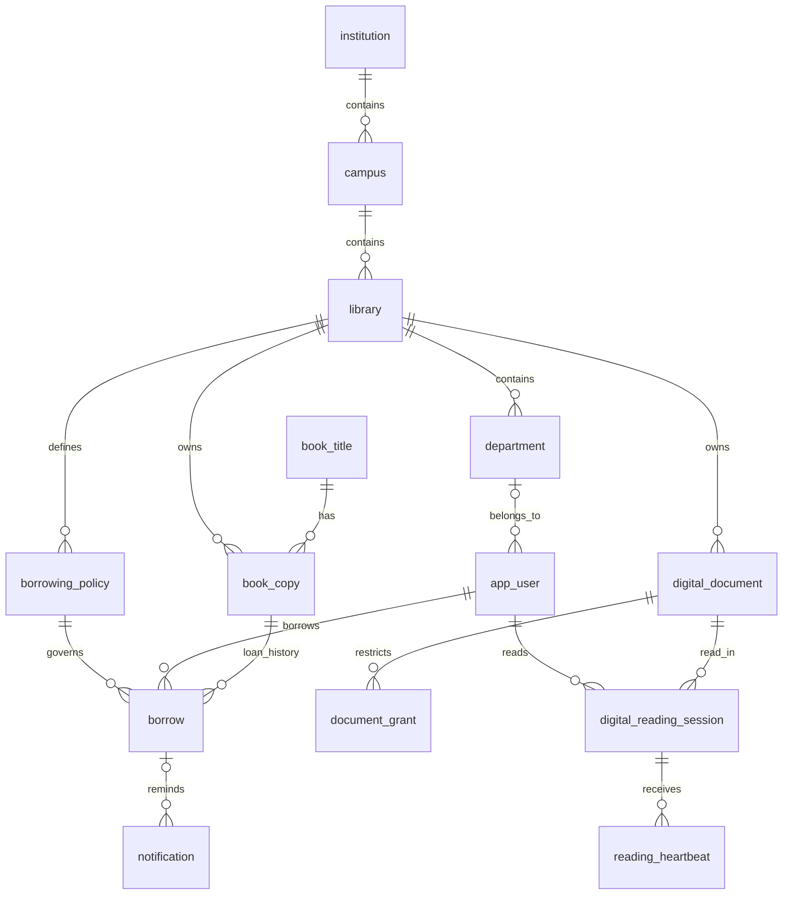

# E-LIB — Thiết kế dữ liệu

`schema.sql` là nguồn DDL duy nhất cho thiết kế phase 0, dùng PostgreSQL 17 và được chạy trong schema kiểm thử riêng. Nó **không** được đưa tự động vào runtime phase 1. Flyway hiện chỉ thiết lập namespace `elib` và lịch sử migration.

## Quan hệ chính

## Quyết định và bất biến

| Nhóm | Thiết kế / ràng buộc |
|---|---|
| Tổ chức | Khoa tham chiếu thư viện theo Guide. Campus/institution của người dùng được suy ra, tránh ba FK mâu thuẫn. Admin chưa gán khoa không tự có quyền đọc tài liệu hạn chế. |
| Người dùng | `app_user` tránh từ khóa SQL `user`; Google subject duy nhất, email unique không phân biệt hoa thường. 4 vai trò xác định, status không null. Session ở Redis, không lưu token plaintext trong DB. |
| Danh mục | Parent FK; tên duy nhất trong cùng parent kể cả root; service phải kiểm tra chu trình nhiều cấp khi di chuyển. |
| Đầu sách / bản sách | Metadata tại `book_title` bao gồm `isbn` (không bắt buộc — sách nội bộ có thể không có) và `publication_year`; barcode, vị trí, thư viện, trạng thái tại `book_copy`. Sequence + UNIQUE tạo mã an toàn đồng thời, không dùng MAX+1. |
| Trạng thái bản sách | `book_copy.status` hỗ trợ: `AVAILABLE` (sẵn sàng), `BORROWED` (đang mượn), `LOST` (mất), `DAMAGED` (hư hỏng), `MAINTENANCE` (đang bảo trì/đóng dấu/dán mã). Chỉ circulation service đổi sang BORROWED; catalog service đổi sang LOST/DAMAGED/MAINTENANCE/AVAILABLE. |
| Mượn/trả | FK bắt buộc user/copy/policy; một CHECK kết hợp trạng thái và thời điểm trả; partial unique index chặn hai khoản mượn mở trên một bản. Không có cột trùng. |
| Policy | Không seed giá trị chưa xác nhận. Policy có phiên bản thời gian; hạn và đơn giá phạt được chụp vào khoản mượn để giữ lịch sử. Thanh toán suy ra từ `fine_paid_at`; UI có thể hiển thị PAID/UNPAID. |
| Tài liệu số | Một storage key duy nhất, không trả key qua API. RESTRICTED mặc định; grant đích tới đúng một institution/campus/department/user. AUTHENTICATED vẫn yêu cầu đăng nhập và tài khoản ACTIVE. |
| Trạng thái tài liệu số | State machine: `DRAFT → PENDING → APPROVED → PUBLISHED`. Librarian upload → DRAFT; submit → PENDING; Admin/Librarian approve → APPROVED; publish → PUBLISHED. Cho phép APPROVED → DRAFT (rework/reject). Chỉ tài liệu PUBLISHED + `is_active=true` mới cho người đọc truy cập. Cân nhắc thêm trạng thái ARCHIVED khi có nhu cầu ẩn tài liệu đã xuất bản mà không xóa. |
| Theo dõi đọc | Tách `physical_reading_session`, `digital_reading_session`, heartbeat và summary. Không còn hai bảng `reading_log`. Session UUID do server tạo; UNIQUE(session,sequence) chống ghi trùng; tổng hợp UNIQUE(user,document). |
| Thông báo | Có FK khoản mượn; deduplication key, số lần thử, lịch thử lại; không gắn nhắc trả sách vào tài liệu số. Bổ sung `notification_type` (DUE_REMINDER/OVERDUE/SYSTEM) và `channel` (EMAIL/IN_APP) ở Phase 9 migration để hỗ trợ nhiều loại và kênh gửi. |
| Audit | Timestamp UTC, request ID; chỉ ghi trường cho phép, không token/secret hoặc toàn bộ request. Hạn chế UPDATE/DELETE ở vai trò DB production. |

## Tìm kiếm full-text (Phase 4)

Dùng PostgreSQL FTS thay vì `LIKE '%query%'`:
- Thêm generated column `search_vector tsvector` trên `book_title` dùng `to_tsvector('simple', coalesce(title,'') || ' ' || coalesce(author,'') || ' ' || coalesce(publisher,''))`.
- GIN index trên `search_vector` cho performance.
- Query dùng `plainto_tsquery('simple', :q)` + `@@` operator.
- Nếu cần ranking: `ts_rank_cd(search_vector, query)`.
- Cân nhắc Elasticsearch ở Phase 13 nếu PG FTS không đủ hiệu năng dưới tải.

## Chiến lược FK giữa Phase 2 và 3

Phase 2 tạo `app_user` **không có** `department_id` column. Phase 3 migration thêm:
1. `ALTER TABLE app_user ADD COLUMN department_id BIGINT REFERENCES department(id)` — nullable ban đầu.
2. Backfill department cho users đã tạo ở Phase 2.
3. Tùy yêu cầu nghiệp vụ, có thể thêm `NOT NULL` constraint sau khi backfill xong.

Code Phase 2 phải xử lý user chưa có department (department = null).

## Transaction và quyền ở tầng service (phase sau)

- Mượn: khóa `book_copy FOR UPDATE`, kiểm tra AVAILABLE, xác thực scope thủ thư/người mượn/policy, thêm `borrow`, đổi copy → BORROWED, commit một transaction. Unique index là lớp bảo vệ cuối; conflict → 409.
- Trả: khóa bản và khoản mượn mở, tính phạt theo policy snapshot, cập nhật returned_at/status và copy AVAILABLE trong cùng transaction. Không xóa lịch sử. Gửi lại lệnh trả đã hoàn tất không tính phạt hai lần.
- DB constraint không thay thế kiểm tra quyền hay kiểm tra copy thuộc thư viện của policy. Các kiểm tra này phải có test tại phase 5.
- Tài liệu: chỉ đọc PUBLISHED + active; kiểm tra grant dựa trên scope server suy ra. Không tin ID tổ chức do frontend gửi.
- Heartbeat: quyền sở hữu session, quyền tài liệu, thứ tự và timestamp server; chỉ cộng khoảng thời gian được giới hạn khi active + visible. Hidden tab không cộng thời gian; idle 60 giây. Nhiều tab không được cộng đúp, cần kiểm thử ở phase 8.
- Thời gian sự kiện dùng TIMESTAMPTZ; tiền NUMERIC, không float. Quy tắc số ngày quá hạn được cấu hình và xác nhận trước phase 5.

## Migration

- Flyway: `backend/src/main/resources/db/migration/V{number}__description.sql`.
- `ddl-auto=validate`, `open-in-view=false`, `clean-disabled=true`; không `update` schema bằng Hibernate.
- Phase 2 tạo `app_user` không có `department_id`; Phase 3 thêm column + FK. Code Phase 2 xử lý department = null.
- Sau khi migration đã áp dụng, chỉ thêm version mới. Test từ DB sạch, validate checksum và migrate lần hai không có thay đổi.
- `schema.sql` mô tả trạng thái đích; cập nhật cùng migration của phase sở hữu. Test trên PostgreSQL thật, không dùng SQLite/H2 để kết luận tương thích.
